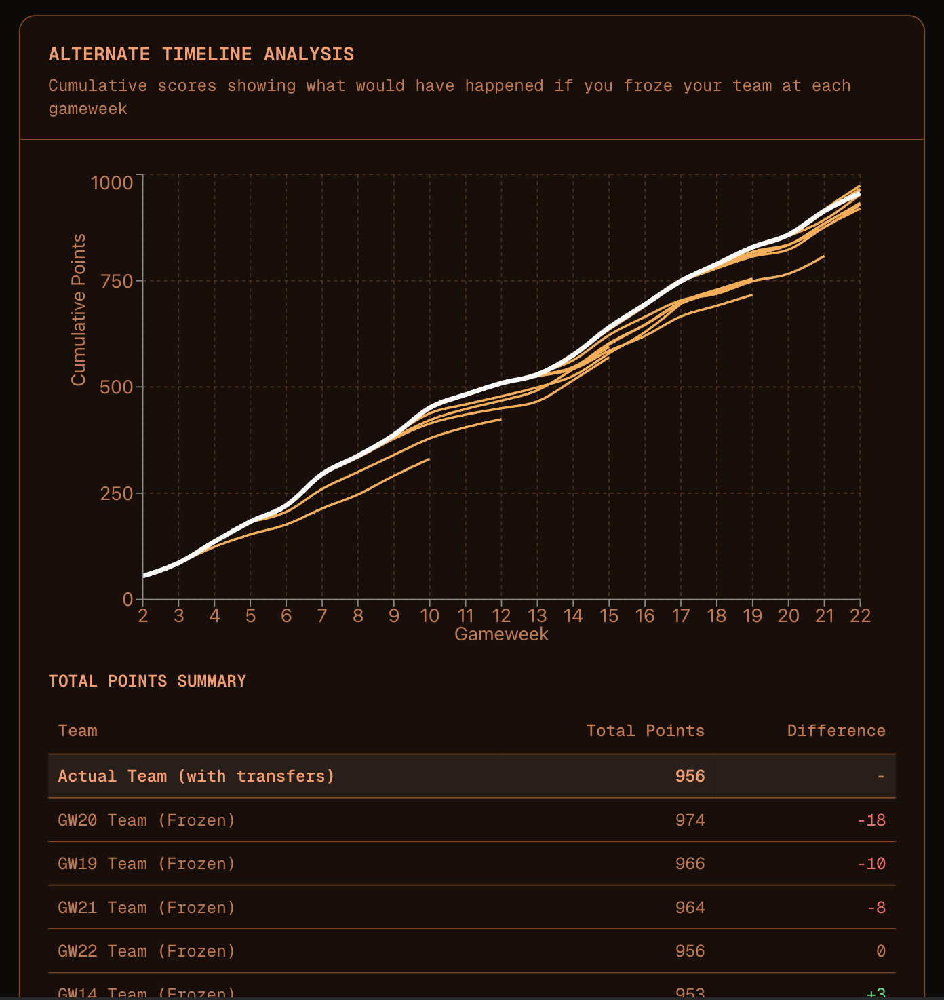
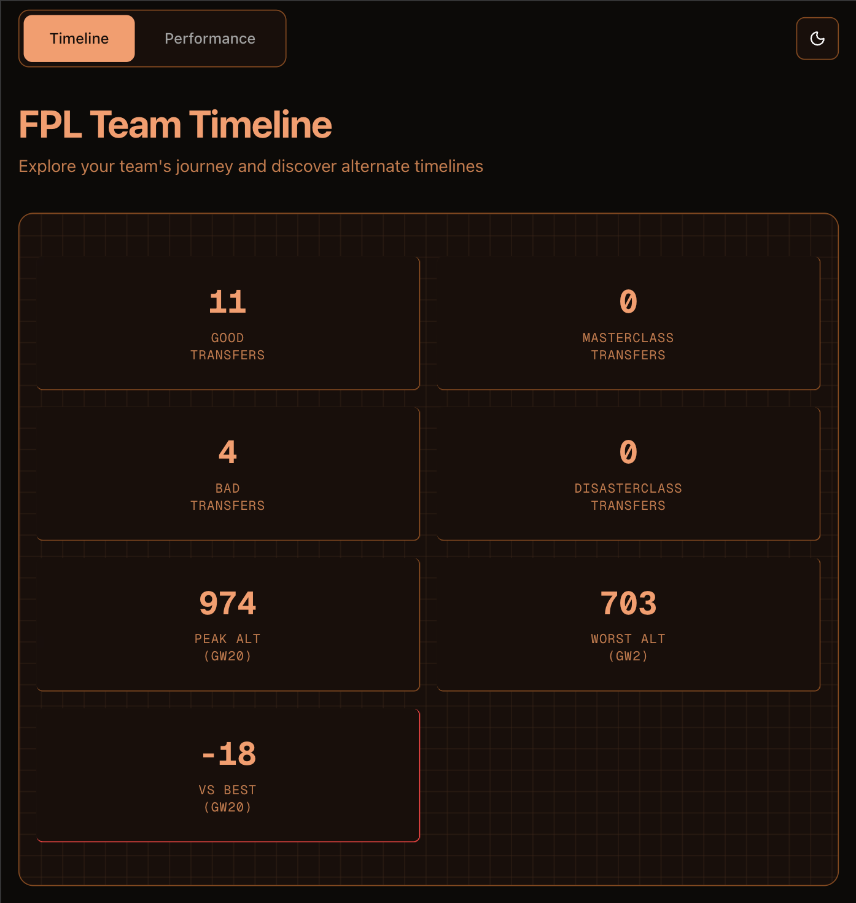
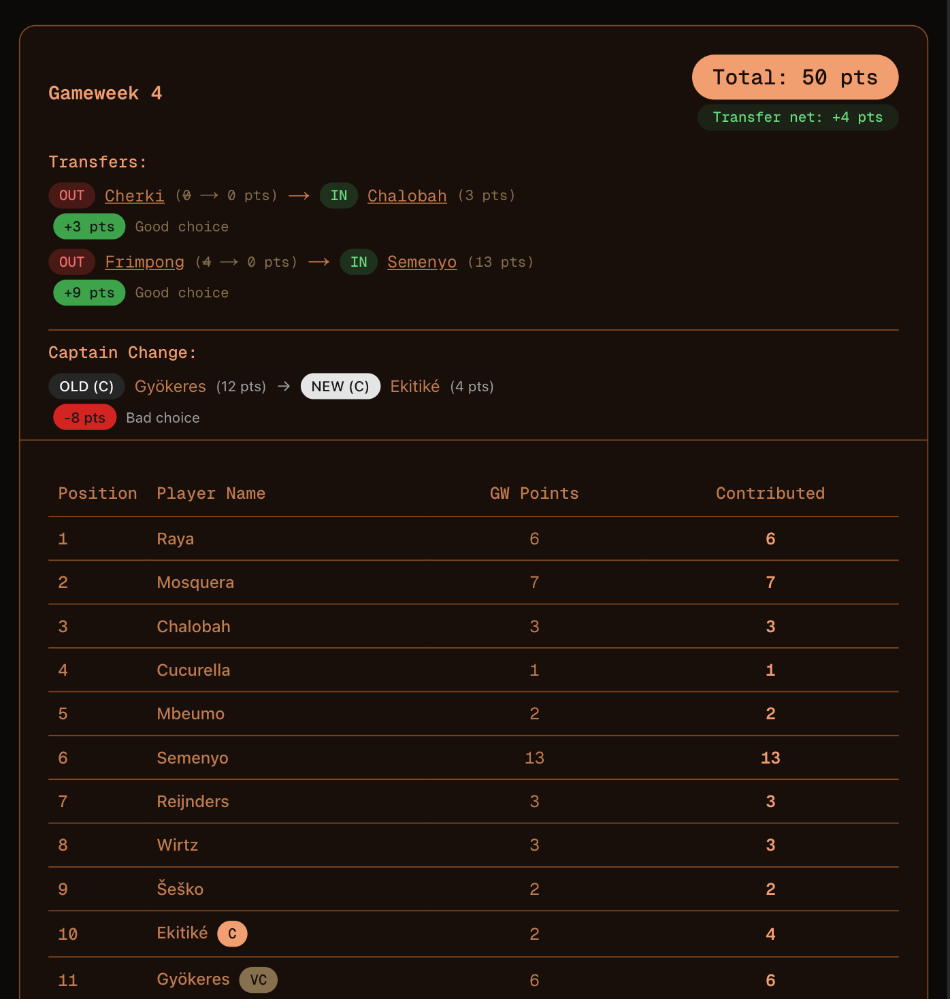
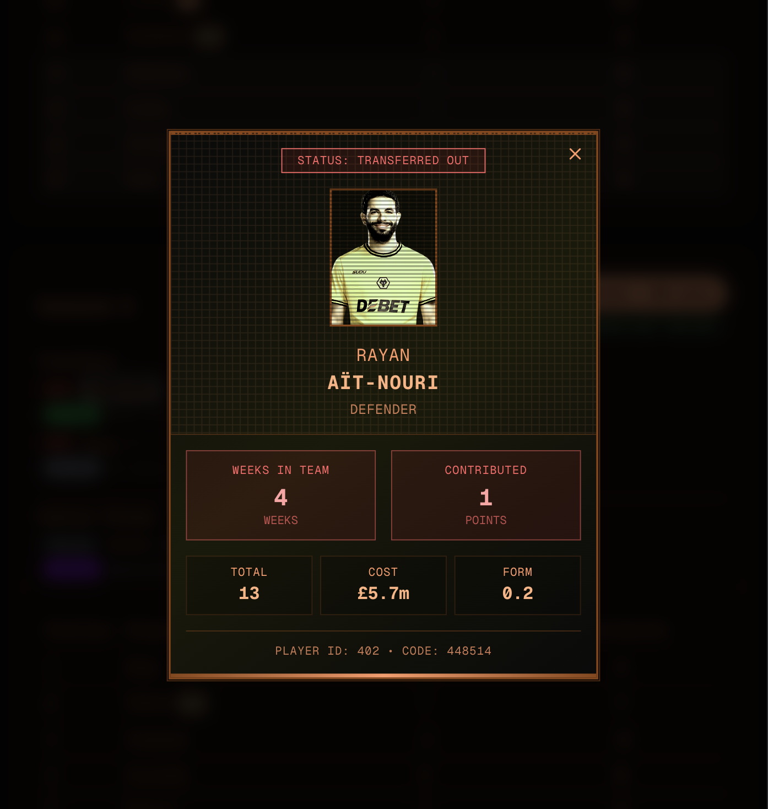

# FPL TEMPAD 🏆⚽

A Fantasy Premier League transfer analysis dashboard that helps you understand if your transfers are paying dividends and visualizes how your team would have performed in alternate timelines without those transfers.



## 📊 What is FPL TEMPAD?

FPL TEMPAD (inspired by the Time Variance Authority) is a comprehensive analysis tool that tracks your Fantasy Premier League team's journey through time. It answers the crucial question: **"What if I hadn't made those transfers?"**

The application creates alternate timeline branches by "freezing" your team composition at different gameweeks and calculating how that unchanged team would have scored in subsequent weeks. This gives you valuable insights into whether your transfer decisions were beneficial or if you should have stuck with your original squad.

## ✨ Key Features

### 🔄 Transfer Analysis Dashboard
- **Timeline Visualization**: Interactive charts showing your actual performance vs. alternate timelines
- **Transfer Impact Assessment**: See exactly how each transfer affected your total points
- **Performance Comparison**: Compare your actual team performance against "what if" scenarios



### 📈 Gameweek Performance Tracking
- **Detailed Statistics**: Comprehensive gameweek-by-gameweek breakdown
- **Player Performance**: Individual player contributions and scoring
- **Team Composition**: Visual representation of your squad changes over time



### 🎯 Player Overlay System
- **Transfer Decisions**: Interactive player cards showing transfer history
- **Performance Metrics**: Detailed player statistics and scoring trends
- **Visual Feedback**: Intuitive UI for understanding player impact



## 🚀 Tech Stack

### Frontend
- **Next.js 16.1.1** with App Router for modern React development
- **React 19.2.3** with server components for optimal performance
- **TypeScript** for type safety and better developer experience
- **Tailwind CSS** with custom dark mode theming
- **Recharts** for interactive data visualization
- **Radix UI** components for accessible UI elements

### Backend & Data
- **Server-Side Rendering (SSR)** for fast initial page loads
- **Direct FPL API Integration** with intelligent caching
- **Custom caching layer** with 1-5 minute revalidation strategies
- **Parallel data fetching** for optimal performance

### Key Technical Features
- **Server Components**: Leveraging Next.js App Router for optimal performance
- **Data Caching**: Intelligent caching with Next.js `revalidate` for FPL API calls
- **Real-time Analysis**: Dynamic calculation of alternate timelines
- **Responsive Design**: Mobile-first approach with dark mode support
- **Type Safety**: Full TypeScript coverage for robust development

## 🔧 Installation & Setup

```bash
# Clone the repository
git clone <repository-url>
cd tempad

# Install dependencies
npm install

# Run development server
npm run dev
```

Open [http://localhost:3000](http://localhost:3000) and enter your FPL Team ID to start analyzing your transfers.

## 📡 API Integration

### FPL API Endpoints
The application integrates directly with the official Fantasy Premier League API:

- **Bootstrap Static**: Player and team data (`/api/bootstrap-static/`)
- **Team Picks**: Gameweek-specific team selections (`/api/entry/{id}/event/{gw}/picks/`)
- **Player Summary**: Detailed player performance (`/api/element-summary/{player_id}/`)
- **Manager Entry**: Team information and overall stats (`/api/entry/{id}/`)

### Caching Strategy
- **Bootstrap Data**: 5-minute cache for player/team static data
- **Team Picks**: 1-minute cache for gameweek-specific data
- **Player Performance**: Real-time fetching with intelligent error handling

## 🎮 How to Use

1. **Get Your Team ID**: Find your FPL Team ID from your Fantasy Premier League URL
2. **Enter Team ID**: Input your team ID on the homepage
3. **Explore Timeline**: View your team's performance timeline with alternate branches
4. **Analyze Performance**: Switch to the Performance tab for detailed statistics
5. **Make Better Decisions**: Use insights to improve future transfer strategies

## 🛠 Available Scripts

```bash
npm run dev          # Start development server
npm run build        # Build for production
npm run start        # Start production server
npm run lint         # Run ESLint
npm run format       # Format code with Prettier
npm run format:check # Check code formatting
npm run analyze      # Analyze bundle size
```

## 🏗 Project Structure

```
├── app/                     # Next.js App Router pages
│   ├── [id]/               # Dynamic team ID routes
│   │   ├── timeline/       # Timeline analysis page
│   │   └── performance/    # Performance dashboard page
│   ├── layout.tsx          # Root layout
│   └── page.tsx           # Homepage
├── components/             # React components
├── lib/                   # Utility functions and API services
│   └── fpl/              # FPL-specific logic
│       ├── operations/   # Business logic operations
│       ├── types/       # TypeScript definitions
│       └── fpl-service.ts # API service layer
└── docs/                 # Documentation and assets
    └── images/          # Screenshots and visual assets
```

## 🤝 Contributing

Contributions are welcome! Please feel free to submit issues or pull requests to improve the application.

## 📄 License

This project is for educational and personal use. Fantasy Premier League is a trademark of The Football Association Premier League Limited.

---

**Built with ❤️ for the FPL community**

*Discover your alternate timelines and make better transfer decisions!*